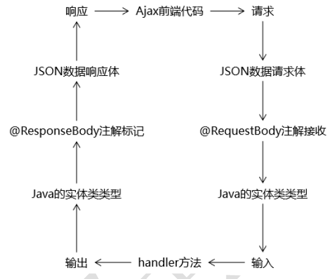

# 2.1 创建工程

## 2.1.1 项目架构


## 2.1.2 创建各个模块

1. 新建一个空项目，命名为crowdfunding

2. 新建一个名为crowdfunding01-admin-parent的Maven Module，在pom文件中修改打包方式为pom

3. 在crowdfunding01-admin-parent下新建三个子模块

   * crowdfunding02-admin-webui
   * crowdfunding03-admin-component
   * crowdfunding04-admin-entity

   > **其中模块crowdfunding02-admin-webui的打包方式需修改为war，并且生成web.xml**

4. 新建以下两个模块
   * crowdfunding05-common-util
   * crowdfunding06-common-reverse

## 2.1.3 建立工程之间的依赖关系

1. 根据项目架构图，模块间的依赖关系为
   * webui 依赖 component
   * component 依赖 entity
   * component 依赖 util


2. 建立依赖关系

   * crowdfunding02-admin-webui的pom文件

   ```xml
   <dependencies>
           <dependency>
               <groupId>com.hypocriticalfish.crowdfunding</groupId>
               <artifactId>crowdfunding03-admin-component</artifactId>
               <version>1.0-SNAPSHOT</version>
           </dependency>
   </dependencies>
   ```

   * crowdfunding03-admin-component的pom文件

   ```xml
   <dependencies>
           <dependency>
               <groupId>com.hypocriticalfish.crowdfunding</groupId>
               <artifactId>crowdfunding05-common-util</artifactId>
               <version>1.0-SNAPSHOT</version>
           </dependency>
           <dependency>
               <groupId>com.hypocriticalfish.crowdfunding</groupId>
               <artifactId>crowdfunding04-admin-entity</artifactId>
               <version>1.0-SNAPSHOT</version>
           </dependency>
   </dependencies>
   ```

# 2.2 创建数据库和数据库表

1. 执行下列sql语句创建数据库和表，数据库版本需为mysql 8.0.28

```sql
CREATE
DATABASE IF NOT EXISTS crowdfunding CHARACTER SET utf8;

USE
crowdfunding;

CREATE TABLE IF NOT EXISTS t_admin
(
   id
   INT
   NOT
   NULL
   AUTO_INCREMENT,
   #主键
   login
   VARCHAR
(
   255
) NOT NULL, #登录账号
   user_pswd CHAR
(
   32
) NOT NULL, #登录密码
   user_name VARCHAR
(
   255
) NOT NULL, #昵称
   email VARCHAR
(
   255
) NOT NULL, #邮箱
   create_time CHAR
(
   19
), #创建时间
   PRIMARY KEY
(
   id
)
   );
```

2. 新建mysql用户

```sql
CREATE
USER 'Hypocritical Fish' @'%' IDENTIFIED BY '123456';	#创建用户

GRANT ALL PRIVILEGES ON crowdfunding.* 
TO 'Hypocritical Fish' @'%';				#赋予用户操作crowdfunding的所有权限
```

# 2.3 基于Maven的MyBatis逆向工程

## 2.3.1 说明

逆向工程为crowdfunding06-common-reverse模块，本节操作均在该模块下进行。

## 2.3.2 配置

1. 在逆向工程模块的pom文件

```xml

<!-- 添加mybatis核心依赖 -->
<dependency>
	<groupId>org.mybatis</groupId>
	<artifactId>mybatis</artifactId>
	<version>3.5.9</version>
</dependency>
```

2. 配置逆向工程插件

```xml
<!-- 控制Maven在构建过程中相关配置 -->
<build>
    <!-- 构建过程中用到的插件 -->
    <plugins>
        <!-- 具体插件，逆向工程的操作是以构建过程中插件形式出现的 -->
        <plugin>
            <groupId>org.mybatis.generator</groupId>
            <artifactId>mybatis-generator-maven-plugin</artifactId>
            <version>1.3.2</version>
            <!-- 插件的依赖 -->
            <dependencies>
                <!-- 逆向工程的核心依赖 -->
                <dependency>
                    <groupId>org.mybatis.generator</groupId>
                    <artifactId>mybatis-generator-core</artifactId>
                    <version>1.3.2</version>
                </dependency>
                <!-- 数据库连接池 -->
                <dependency>
                    <groupId>com.mchange</groupId>
                    <artifactId>c3p0</artifactId>
                    <version>0.9.2</version>
                </dependency>
                <!-- MySQL驱动 -->
                <dependency>
                    <groupId>mysql</groupId>
                    <artifactId>mysql-connector-java</artifactId>
                    <version>8.0.28</version>
                </dependency>
            </dependencies>
        </plugin>
    </plugins>
</build>
```

3. 在resource目录下创建逆向工程的配置文件，**文件名必须为generatorConfig.xml**

需要修改自行实体类、mapper文件、SQL 映射文件的位置，以及数据库连接池基本参数。

```xml
<?xml version="1.0" encoding="UTF-8" ?>
<!DOCTYPE generatorConfiguration
        PUBLIC "-//mybatis.org//DTD MyBatis Generator Configuration 1.0//EN"
        "http://mybatis.org/dtd/mybatis-generator-config_1_0.dtd" >
<generatorConfiguration>
    <!--
        生成逆向工程的版本：
        MyBatis3Simple：生成基本的CRUD
        MyBatis3:生成带条件的CRUD
    -->
    <context id="DB2Tables" targetRuntime="MyBatis3">

        <commentGenerator>
            <!--是否去除自动生成的注释 true:是 ;false:否-->
            <property name="suppressAllComments" value="true" />
        </commentGenerator>

        <!--数据库连接的信息：驱动类、连接地址、用户名、密码-->
        <jdbcConnection driverClass="com.mysql.cj.jdbc.Driver"
                        connectionURL="jdbc:mysql://localhost:3306/crowdfunding?serverTimezone=Asia/Shanghai"
                        userId="Hypocritical Fish"
                        password="123456">
        </jdbcConnection>

        <!--
            默认 false，把 JDBC DECIMAL 和 NUMERIC 类型解析为 Integer，为 true时把
            JDBC DECIMAL和 NUMERIC 类型解析为 java.math.BigDecimal
        -->
        <javaTypeResolver>
            <property name="forceBigDecimals" value="false" />
        </javaTypeResolver>

        <!-- 生成实体类地址 -->
        <javaModelGenerator targetPackage="com.hypocriticalfish.crowdfunding.entity"
                            targetProject="./src/main/java" >
            <!-- 是否在当前路径下新加一层schema,eg：fase路径com.oop.eksp.user.model， true:com.oop.eksp.user.model.[schemaName] -->
            <property name="enableSubPackages" value="false"/>
            <!-- 是否针对string类型的字段在set的时候进行trim调用 -->
            <property name="trimStrings" value="true"/>
        </javaModelGenerator>

        <!-- SQL映射文件的生成策略 -->
        <sqlMapGenerator targetPackage="com.hypocriticalfish.crowdfunding.mapper"
                         targetProject="./src/main/resources" >
            <!-- 是否在当前路径下新加一层schema,eg：fase路径com.oop.eksp.user.model， true:com.oop.eksp.user.model.[schemaName] -->
            <property name="enableSubPackages" value="true" />
        </sqlMapGenerator>

        <!-- Mapper接口的生成策略 -->
        <javaClientGenerator targetPackage="com.hypocriticalfish.crowdfunding.mapper"
                             targetProject="./src/main/java" type="XMLMAPPER" >
            <!-- 是否在当前路径下新加一层schema,eg：fase路径com.oop.eksp.user.model， true:com.oop.eksp.user.model.[schemaName] -->
            <property name="enableSubPackages" value="false" />
        </javaClientGenerator>

        <!-- 配置表信息 -->
        <table tableName="t_admin" domainObjectName="Admin"/>
        <!-- schema即为数据库名 tableName为对应的数据库表 domainObjectName是要生成的实体类 enable*ByExample
            是否生成 example类   -->

    </context>
</generatorConfiguration>
```

## 2.3.3 构建

1. 构建的方式有两种

   	* 使用Maven命令：mybatis-generator:generate -e
   	* idea图形化构建

   


2. 补全Admin类的无参构造方法、全参构造方法和toString方法。
3. 资源归位
   * 在模块crowdfunding02-admin-webui的resources目录下新建 mybatis/mapper文件夹
   * 将刚刚生成的AdminMapper.xml移动到该文件夹下
   * 将Admin和AdminExample类移动到crowdfunding04-admin-entity模块下
   * 将AdminMapper类移动到crowdfunding03-admin-component模块下
4. 解决报错问题
   - AdminMapper会报错，找不到 `Param` 注解
   - 在crowdfunding03-admin-component模块的pom.xml文件中加入mybatis的核心依赖即可

# 2.4 父工程依赖管理

接下来需要在crowdfunding01-admin-parent模块下的pom.xml中引入相应的依赖和版本声明。

1. 版本声明

```xml
<properties>
        <!--声明属性，对 Spring的版本进行统一管理-->
        <spring.version>4.3.20.RELEASE</spring.version>
        <!--声明属性，对 Spring Security的版本进行统一管理-->
        <spring.security.version>4.2.10.RELEASE</spring.security.version>
</properties>
```

2. 依赖管理dependencyManagement

```xml
<dependencyManagement>
    <dependencies>
        <!-- Spring 依赖 -->
        <!-- https://mvnrepository.com/artifact/org.springframework/spring-orm -->
        <dependency>
            <groupId>org.springframework</groupId>
            <artifactId>spring-orm</artifactId>
            <version>${spring.version}</version>
        </dependency>
        <!-- https://mvnrepository.com/artifact/org.springframework/spring-webmvc -->
        <dependency>
            <groupId>org.springframework</groupId>
            <artifactId>spring-webmvc</artifactId>
            <version>${spring.version}</version>
        </dependency>
        <dependency>
            <groupId>org.springframework</groupId>
            <artifactId>spring-test</artifactId>
            <version>${spring.version}</version>
        </dependency>
        <!-- https://mvnrepository.com/artifact/org.aspectj/aspectjweaver -->
        <dependency>
            <groupId>org.aspectj</groupId>
            <artifactId>aspectjweaver</artifactId>
            <version>1.9.9.1</version>
            <scope>runtime</scope>
        </dependency>
        <!-- https://mvnrepository.com/artifact/cglib/cglib -->
        <dependency>
            <groupId>cglib</groupId>
            <artifactId>cglib</artifactId>
            <version>3.3.0</version>
        </dependency>
        <!-- 数据库依赖 -->
        <!-- MySQL 驱动 -->
        <!-- https://mvnrepository.com/artifact/mysql/mysql-connector-java -->
        <dependency>
            <groupId>mysql</groupId>
            <artifactId>mysql-connector-java</artifactId>
            <version>8.0.28</version>
        </dependency>
        <!-- 数据源 -->
        <!-- https://mvnrepository.com/artifact/com.alibaba/druid -->
        <dependency>
            <groupId>com.alibaba</groupId>
            <artifactId>druid</artifactId>
            <version>1.2.9</version>
        </dependency>
        <!-- MyBatis -->
        <dependency>
            <groupId>org.mybatis</groupId>
            <artifactId>mybatis</artifactId>
            <version>3.5.9</version>
        </dependency>
        <!-- MyBatis 与 Spring 整合 -->
        <dependency>
            <groupId>org.mybatis</groupId>
            <artifactId>mybatis-spring</artifactId>
            <version>2.0.7</version>
        </dependency>
        <!-- MyBatis 分页插件 -->
        <dependency>
            <groupId>com.github.pagehelper</groupId>
            <artifactId>pagehelper</artifactId>
            <version>5.3.0</version>
        </dependency>
        <!-- 日志 -->
        <!-- https://mvnrepository.com/artifact/org.slf4j/slf4j-api -->
        <dependency>
            <groupId>org.slf4j</groupId>
            <artifactId>slf4j-api</artifactId>
            <version>2.0.0-alpha7</version>
        </dependency>
        <!-- https://mvnrepository.com/artifact/ch.qos.logback/logback-classic -->
        <dependency>
            <groupId>ch.qos.logback</groupId>
            <artifactId>logback-classic</artifactId>
            <version>1.3.0-alpha14</version>
            <scope>test</scope>
        </dependency>
        <!-- 其他日志框架的中间转换包 -->
        <!-- https://mvnrepository.com/artifact/org.slf4j/jcl-over-slf4j -->
        <dependency>
            <groupId>org.slf4j</groupId>
            <artifactId>jcl-over-slf4j</artifactId>
            <version>2.0.0-alpha7</version>
        </dependency>
        <!-- https://mvnrepository.com/artifact/org.slf4j/jul-to-slf4j -->
        <dependency>
            <groupId>org.slf4j</groupId>
            <artifactId>jul-to-slf4j</artifactId>
            <version>2.0.0-alpha7</version>
        </dependency>
        <!-- Spring 进行 JSON 数据转换依赖 -->
        <dependency>
            <groupId>com.fasterxml.jackson.core</groupId>
            <artifactId>jackson-core</artifactId>
            <version>2.13.2</version>
        </dependency>
        <dependency>
            <groupId>com.fasterxml.jackson.core</groupId>
            <artifactId>jackson-databind</artifactId>
            <version>2.13.2.2</version>
        </dependency>
        <!-- JSTL 标签库 -->
        <!-- https://mvnrepository.com/artifact/javax.servlet.jsp.jstl/jstl-api -->
        <dependency>
            <groupId>javax.servlet.jsp.jstl</groupId>
            <artifactId>jstl-api</artifactId>
            <version>1.2</version>
        </dependency>
        <!-- junit 测试 -->
        <dependency>
            <groupId>junit</groupId>
            <artifactId>junit</artifactId>
            <version>4.13.2</version>
            <scope>test</scope>
        </dependency>
        <!-- 引入 Servlet 容器中相关依赖 -->
        <!-- https://mvnrepository.com/artifact/javax.servlet/javax.servlet-api -->
        <dependency>
            <groupId>javax.servlet</groupId>
            <artifactId>javax.servlet-api</artifactId>
            <version>3.1.0</version>
            <scope>provided</scope>
        </dependency>
        <!-- JSP 页面使用的依赖 -->
        <!-- https://mvnrepository.com/artifact/javax.servlet.jsp/javax.servlet.jsp-api -->
        <dependency>
            <groupId>javax.servlet.jsp</groupId>
            <artifactId>javax.servlet.jsp-api</artifactId>
            <version>2.3.3</version>
            <scope>provided</scope>
        </dependency>
        <!-- https://mvnrepository.com/artifact/com.google.code.gson/gson -->
        <dependency>
            <groupId>com.google.code.gson</groupId>
            <artifactId>gson</artifactId>
            <version>2.9.0</version>
        </dependency>
        <!-- SpringSecurity 对 Web 应用进行权限管理 -->
        <!-- https://mvnrepository.com/artifact/org.springframework.security/spring-security-web -->
        <dependency>
            <groupId>org.springframework.security</groupId>
            <artifactId>spring-security-web</artifactId>
            <version>5.6.3</version>
        </dependency>
        <!-- SpringSecurity 配置 -->
        <!-- https://mvnrepository.com/artifact/org.springframework.security/spring-security-config -->
        <dependency>
            <groupId>org.springframework.security</groupId>
            <artifactId>spring-security-config</artifactId>
            <version>5.6.3</version>
        </dependency>
        <!-- SpringSecurity 标签库 -->
        <!-- https://mvnrepository.com/artifact/org.springframework.security/spring-security-taglibs -->
        <dependency>
            <groupId>org.springframework.security</groupId>
            <artifactId>spring-security-taglibs</artifactId>
            <version>5.6.3</version>
        </dependency>
    </dependencies>
</dependencyManagement>
```

3. dependencyManagement详解

> - 常用于多模块环境下定义一个top module来专门管理公共依赖
> - 若dependencies里的dependency自己没有声明version，那么maven就会到depenManagement 里去找
> - 若 dependencies 中的 dependency 声明了version，则 dependencyManagement 中的声明无效
> - dependencyManagement 只是声明依赖的版本号，该依赖不会引入，因此子项目需要显示声明所需要引入的依赖，若不声明则不引入

# 2.5 Spring整合MyBatis

## 2.5.1 整合思路


## 2.5.2 具体配置

1. 子工程中加入依赖

   - 子工程选择component，因为webui依赖component，因此可以使用component的依赖（依赖传递）

   - junit和spring-test依赖生命周期设置为test，不能传递，因此各项目使用时要在自己的pom.xml文件总引入

   - 在component模块的pom文件中加入依赖:

   ```xml
   <!--Junit测试-->
   <dependency>
       <groupId>org.junit.jupiter</groupId>
       <artifactId>junit-jupiter-api</artifactId>
       <version>5.8.2</version>
       <scope>test</scope>
   </dependency>
   <!-- Spring 依赖 -->
   <dependency>
       <groupId>org.springframework</groupId>
       <artifactId>spring-orm</artifactId>
   </dependency>
   <dependency>
       <groupId>org.springframework</groupId>
       <artifactId>spring-webmvc</artifactId>
   </dependency>
   <dependency>
       <groupId>org.springframework</groupId>
       <artifactId>spring-test</artifactId>
       <scope>test</scope>
   </dependency>
   <dependency>
   <groupId>org.aspectj</groupId>
   <artifactId>aspectjweaver</artifactId>
   </dependency>
   <dependency>
       <groupId>cglib</groupId>
       <artifactId>cglib</artifactId>
   </dependency>
   <!-- 数据库依赖 -->
   <!-- MySQL 驱动 -->
   <dependency>
       <groupId>mysql</groupId>
       <artifactId>mysql-connector-java</artifactId
   </dependency>
   <!-- 数据源 -->
   <dependency>
       <groupId>com.alibaba</groupId>
       <artifactId>druid</artifactId>
   </dependency>
   <!-- MyBatis 与 Spring 整合 -->
   <dependency>
       <groupId>org.mybatis</groupId>
       <artifactId>mybatis-spring</artifactId>
   </dependency>
   <!-- MyBatis 分页插件 -->
   <dependency>
       <groupId>com.github.pagehelper</groupId>
       <artifactId>pagehelper</artifactId>
   </dependency>
   <!-- Spring 进行 JSON 数据转换依赖 -->
   <dependency>
       <groupId>com.fasterxml.jackson.core</groupId
       <artifactId>jackson-core</artifactId>
   </dependency>
   <dependency>
       <groupId>com.fasterxml.jackson.core</groupId
       <artifactId>jackson-databind</artifactId>
   </dependency>
   <!-- JSTL 标签库 -->
   <dependency>
       <groupId>javax.servlet.jsp.jstl</groupId>
       <artifactId>jstl-api</artifactId>
   </dependency>
   <dependency>
       <groupId>com.google.code.gson</groupId>
       <artifactId>gson</artifactId>
   </dependency>
   ```


2. 数据库连接池配置

   - mysql8.0以后的数据库连接池，必须在url中指定时区

   - 在webui模块下的resources目录下新建 jdbc.perperties文件

   ```properties
   jdbc.driver=com.mysql.cj.jdbc.Driver
   jdbc.url=jdbc:mysql://localhost:3306/crowdfunding?serverTimezone=Asia/Shanghai&useUnicode=true&characterEncoding=utf8&useSSL=false&allowPublicKeyRetrieval=true
   jdbc.username=Hypocritical Fish
   jdbc.password=123456
   ```


3. 创建mybatis配置文件

4. 创建spring-mybatis整合配置文件

   - 在webui模块下的resources目录下新建 spring-persist-mybatis.xml文件

   - 在文件中配置数据库连接池：

   ```xml
   <?xml version="1.0" encoding="UTF-8"?>
   <beans xmlns="http://www.springframework.org/schema/beans"
          xmlns:xsi="http://www.w3.org/2001/XMLSchema-instance"
          xmlns:context="http://www.springframework.org/schema/context"
          xsi:schemaLocation="http://www.springframework.org/schema/beans http://www.springframework.org/schema/beans/spring-beans.xsd http://www.springframework.org/schema/context https://www.springframework.org/schema/context/spring-context.xsd">
   
       <!--加载外部属性文件-->
       <context:property-placeholder location="classpath:jdbc.properties"/>
   
       <!--配置数据源-->
       <bean id="dataSource" class="com.alibaba.druid.pool.DruidDataSource">
           <property name="username" value="${jdbc.username}"/>
           <property name="password" value="${jdbc.password}"/>
           <property name="url" value="${jdbc.url}"/>
           <property name="driverClassName" value="${jdbc.driver}"/>
       </bean>
   </beans>
   ```

5. 测试能否根据数据源获取连接

   * 这里使用Spring5和Junit5整合的方式，需要在webui的pom.xml文件中加入junit和spring-test依赖：

     ```xml
     <dependency>
         <groupId>org.junit.jupiter</groupId>
         <artifactId>junit-jupiter-api</artifactId>
         <scope>test</scope>
     </dependency>
     <dependency>
         <groupId>org.springframework</groupId>
         <artifactId>spring-test</artifactId>
     </dependency>
     ```

   * 在webui模块的test/java目录下新建包com.hypocriticalfish.crowdfunding

   * 在新建的包中新建测试类CrowdTest:

   ```java
   package com.hypocriticalfish.crowdfunding;
   
   import org.junit.jupiter.api.Test;
   import org.springframework.beans.factory.annotation.Autowired;
   import org.springframework.test.context.junit.jupiter.SpringJUnitConfig;
   
   import javax.sql.DataSource;
   import java.sql.Connection;
   import java.sql.SQLException;
   
   @SpringJUnitConfig(locations = "classpath:spring-persist-mybatis.xml")
   public class CrowdTest {
       @Autowired
       DataSource dataSource;
   
       @Test
       public void testConnection() throws SQLException {
           Connection connection = dataSource.getConnection();
           System.out.println(connection);
       }
   }
   ```

   * 测试通过代表配置成功，可以正常获取连接


6. 配置SqlSessionFactory（修改spring-persist-mybatis.xml文件）

```xml
<!--配置SqlSessionFactoryBean整合MyBatis-->
<bean id="sqlSessionFactoryBean" class="org.mybatis.spring.SqlSessionFactoryBean">
    <!--指定mybatis全局配置文件位置-->
    <property name="configLocation" value="classpath:mybatis/mybatis-config.xml"/>
    <!--指定mapper配置文件位置-->
    <property name="mapperLocations" value="classpath:mybatis/mapper/*Mapper.xml"/>
    <!--装配数据源：引用前面的dataSource数据源-->
    <property name="dataSource" ref="dataSource"/>
</bean>
```

7. 配置mybatis扫描器

```xml
<!--配置mybatis的扫描器，扫描mapper接口所在的包，创建dao对象-->
<bean id="mapperScannerConfigurer" class="org.mybatis.spring.mapper.MapperScannerConfigurer">
    <property name="basePackage" value="com.atguigu.crowd.mapper"/>
</bean>
```

8. 在CrowdTest类中测试新建管理员用户是否成功

```java
@Autowired
AdminMapper adminMapper;
@Test
public void testCreateAdmin(){
        Admin admin=new Admin(null,"Hypocriticalfish","123456","Hypocriticalfish","123456@qq.com",null);
        int count=adminMapper.insert(admin);
        System.out.println(count);
        }
```

控制台输出1代表操作数据库没有问题。

# 2.6 日志系统

1. 使用sl4j门面（接口）+logback（实现）来替换Spring5原生的日志系统。在webui的pom文件中加入如下依赖：

```xml
<!-- 日志 -->
<dependency>
    <groupId>org.slf4j</groupId>
    <artifactId>slf4j-api</artifactId>
</dependency>
<dependency>
    <groupId>ch.qos.logback</groupId>
    <artifactId>logback-classic</artifactId>
</dependency>
```

2. 修改日志配置文件，在/src/main/resource/文件夹下新建logback.xml文件：

```xm
<?xml version="1.0" encoding="UTF-8"?>
<configuration debug="true">
    <!-- 指定日志输出的位置 -->
    <appender name="STDOUT"
            class="ch.qos.logback.core.ConsoleAppender">
        <encoder>
            <!-- 日志输出的格式 -->
            <!-- 按照顺序分别是： 时间、 日志级别、 线程名称、 打印日志的类、 日志主体内容、 换行 -->
            <pattern>[%d{HH:mm:ss.SSS}] [%-5level] [%thread] [%logger]
                [%msg]%n
            </pattern>
        </encoder>
    </appender>
    <!-- 设置全局日志级别。 日志级别按顺序分别是： DEBUG、 INFO、 WARN、 ERROR -->
    <!-- 指定任何一个日志级别都只打印当前级别和后面级别的日志。 -->
    <root level="INFO">
        <!-- 指定打印日志的 appender， 这里通过“STDOUT”引用了前面配置的 appender -->
        <appender-ref ref="STDOUT"/>
    </root>
    <!-- 根据特殊需求指定局部日志级别 -->
    <logger name="com.atguigu.crowd.mapper" level="DEBUG"/>
</configuration>
```

# 2.7 声明式事务

## 2.7.1 目标

* 从事务角度：一个事务方法中包含的多个数据库操作，要么一起提交、要么一起回
  滚。也就是说事务方法中的多个数据库操作，有任何一个失败，整个事务全部回滚。
* 从声明式角度：由Spring来全面接管数据库事务。用声明式代替编程式。

```java
try{
        // 核心操作前：开启事务（关闭自动提交）
        // 对应 AOP的前置通知
        connection.setAutoCommit(false);
        // 核心操作
        adminService.updateXxx(xxx,xxx);
        // 核心操作成功：提交事务
        // 对 应 AOP的返回通知
        connection.commit();
        }catch(Exception e){
        // 核心操作失败：回滚事务
        // 对应 AOP的异常通知
        connection.rollBack();
        }finally{
        // 不论成功还是失败，核心操作终归是结束了
        // 核心操作不管是怎么结束的，都需要释放数据库连接
        // 对应 AOP的后置通知
        if(connection!=null){
        connection.close();
        }
        }
```

## 2.7.2 思路


## 2.7.3 操作步骤

1. 在webui模块加入依赖

```xml
<dependency>
    <groupId>org.aspectj</groupId>
    <artifactId>aspectjweaver</artifactId>
</dependency>
<dependency>
    <groupId>cglib</groupId>
    <artifactId>cglib</artifactId>
</dependency>
```

2. 在webui模块下的resources中创建spring配置文件spring-persist-tx.xml：

```xml
<!--1. 配置自动扫描的包：主要是为了把Service扫描到IOC容器中-->
<context:component-scan base-package="com.atguigu.crowd.service"/>

<!--2. 配置事务管理器-->
<bean id="txManager" class="org.springframework.jdbc.datasource.DataSourceTransactionManager">
    <!--装配数据源-->
    <property name="dataSource" ref="dataSource"/>
</bean>

<!--3. 配置AOP-->
<aop:config>
    <!--考虑到后面整合SpringSecurity，避免把UserDetailService加入事务控制。让切入点表达式定位到ServiceImpl而不是Service-->
    <aop:pointcut id="txPointcut" expression="execution(* *..*ServiceImpl.*(..))"/>
    <!--将切入点表达式跟事务通知关联起来-->
    <aop:advisor advice-ref="txAdvice" pointcut-ref="txPointcut"/>
</aop:config>

<!--4. 配置事务通知-->
<tx:advice id="txAdvice" transaction-manager="txManager">
    <!--配置事务属性-->
    <tx:attributes>
        <!--查询方法：配置只读属性，让数据库知道这是一个查询操作，能够进行一定优化-->
        <!--service中一般查询方法一般以get、find等开头-->
        <tx:method name="get*" read-only="true"/>
        <tx:method name="find*" read-only="true"/>
        <tx:method name="query*" read-only="true"/>
        <tx:method name="count*" read-only="true"/>

        <!--增删改-->
        <tx:method name="save*" propagation="REQUIRES_NEW" rollback-for="java.lang.Exception"/>
        <tx:method name="update*" propagation="REQUIRES_NEW" rollback-for="java.lang.Exception"/>
        <tx:method name="remove*" propagation="REQUIRES_NEW" rollback-for="java.lang.Exception"/>
        <tx:method name="batch*" propagation="REQUIRES_NEW" rollback-for="java.lang.Exception"/>
    </tx:attributes>
</tx:advice>
```

3. 测试

   * 在component模块下新建service接口及其实现方法，注意在方法中造一个运行时异常

   * 在webui测试类中进行测试

   ```java
   @SpringJUnitConfig(locations = {"classpath:spring-persist-tx.xml","classpath:spring-persist-mybatis.xml"})
   public class CrowdTest {
       
       @Autowired
       AdminService adminService;
       
       @Test
       public void testTx(){
           Admin admin = new Admin(null, "Admin", "admin123456", "Admin", "654321@qq.com", null);
           adminService.saveAdmin(admin);
       }
   }    
   ```


4. **注意事项**：在基于xml的声明式事务中，配置文件中事务属性的 tx:method 是必须配置的，如果没有配置则事务对这个方法不生效

# 2.8 表述层配置

## 2.8.1 表述层工作机制

1. 项目启动过程


2. 访问过程

page→ handler（@RequestMapping） → Service → Mapper → DataBase

## 2.8.2 环境搭建

1. webui模块下新增web.xml文件,按照加载次序依次新增下列内容

* ContextLoaderListener

```xml
<!--ContextLoaderListener-->
<context-param>
    <param-name>contextConfigLocation</param-name>
    <param-value>classpath:spring-persist-*.xml</param-value>
</context-param>
<!-- Bootstraps the root web application context before servlet initialization -->
<listener>
    <listener-class>org.springframework.web.context.ContextLoaderListener</listener-class>
</listener>
```

* CharacterEncodingFilter

```xml
<filter>
    <filter-name>characterEncodingFilter</filter-name>
    <filter-class>org.springframework.web.filter.CharacterEncodingFilter</filter-class>
    <init-param>
        <param-name>encoding</param-name>
        <param-value>UTF-8</param-value>
    </init-param>
    <init-param>
        <param-name>forceRequestEncoding</param-name>
        <param-value>true</param-value>
    </init-param>
    <init-param>
        <param-name>forceResponseEncoding</param-name>
        <param-value>true</param-value>
    </init-param>
</filter>
<!--这个Filter执行顺序要在所有其它Filter前面-->
<filter-mapping>
    <filter-name>characterEncodingFilter</filter-name>
    <url-pattern>/*</url-pattern>
</filter-mapping>
```

* HiddenHttpMethodFilter
  遵循 RESTFUL 风格将 POST 请求转换为 PUT 请求、 DELETE 请求时使用。这里暂且不配
* DispatcherServlet

```xml
<!-- 配置 SpringMVC 的前端控制器 -->
<!-- The front controller of this Spring Web application, responsible for handling all application
requests -->
<servlet>
    <servlet-name>springDispatcherServlet</servlet-name>
    <servlet-class>org.springframework.web.servlet.DispatcherServlet</servlet-class>
    <init-param>
        <param-name>contextConfigLocation</param-name>
        <param-value>classpath:spring-web-mvc.xml</param-value>
    </init-param>
    <!-- 让 DispatcherServlet 在 Web 应用启动时创建对象、 初始化 -->
    <!-- 默认情况： Servlet 在第一次请求的时候创建对象、 初始化 -->
    <load-on-startup>1</load-on-startup>
</servlet>
<servlet-mapping>
    <!-- DispatcherServlet 映射的 URL 地址 -->
    <servlet-name>springDispatcherServlet</servlet-name>
    <url-pattern>/</url-pattern><!--拦截所有请求-->
    <!--方式二
    <url-pattern>*.html</url-pattern>
    <url-pattern>*.json</url-pattern>
        优点：伪静态效果，给黑客入侵增加难度、有利于SEO优化
        缺点：不符合RESTFUL风格、请求扩展名不匹配时会406错误
    -->
</servlet-mapping>
```

2. SpringMVC 配置

* webui模块下的resources目录下新建spring-web-mvc.xml

```xml
<!--自动扫描-->
<context:component-scan base-package="com.atguigu.crowd.mvc"/>

<!--配置springmvc注解驱动-->
<mvc:annotation-driven/>

<!--配置视图解析器-->
<bean id="viewResolver" class="org.springframework.web.servlet.view.InternalResourceViewResolver">
    <property name="prefix" value="/WEB-INF/"/>
    <property name="suffix" value=".jsp"/>
</bean>
```

* component模块的crowd包下新建mvc包，mvc下新建config、handler、interceptor三个包

## 2.8.3 使用base标签

1. 在jsp页面中使用base标签，从而简化连接，避免回退异常
2. 在index.jsp的head部分加入base标签：

```jsp
<head>
<title>测试页面</title>
    <base href="http://${pageContext.request.serverName}:${pageContext.request.serverPort}${pageContext.request.contextPath}/">
</head>
```

3. 说明

   - base 标签必须在所有“带具体路径” 的标签的前面

   - serverName 部分 EL 表达式和 serverPort 部分 EL 表达式之间必须写“:”
      - serverPort 部分 EL 表达式和 contextPath 部分 EL 表达式之间绝对不能写“/”
         - contextPath 部分 EL 表达式本身就是“/” 开头
         - 如果多写一个“/” 会干扰 Cookie 的工作机制

   - serverPath 部分 EL 表达式后面必须写“/

## 2.8.4 测试

1. webui模块中加入依赖

```xml
<!-- 引入 Servlet 容器中相关依赖 -->
<dependency>
    <groupId>javax.servlet</groupId>
    <artifactId>javax.servlet-api</artifactId>
    <scope>provided</scope>
</dependency>
<!-- JSP 页面使用的依赖 -->
<dependency>
    <groupId>javax.servlet.jsp</groupId>
    <artifactId>javax.servlet.jsp-api</artifactId>
    <scope>provided</scope>
</dependency>
```

2. component模块handler包下新建TestHandler类

```java
@Controller
public class TestHandler {

    @Autowired
    private AdminService adminService;

    @RequestMapping("/test/ssm.html")
    public String testSSM(ModelMap modelMap){
        List<Admin> adminList = adminService.getAll();
        modelMap.addAttribute("adminList",adminList);
        return "target";
    }
}
```

3. webui模块WEB-INF目录下新建target.jsp

```jsp
<%@ page contentType="text/html;charset=UTF-8" language="java" %>
<html>
<head>
    <title>AdminList</title>
</head>
<body>

    <h1>Success</h1>
    ${requestScope.adminList}

</body>
</html>
```

4. Componenr模块下的service包中创建对应AdminService接口及其实现类

5. 启动Tomcat服务器，访问index页面

## 2.9 SpringMVC下的Ajax请求

## 2.9.1 说明

1. 普通请求与Ajax请求

   	* 普通请求：后端处理完成后返回页面， 浏览器使用使用页面替换整个窗口中的内容

   	* Ajax请求：后端处理完成后通常返回 JSON 数据， jQuery 代码使用 JSON 数据对页面局部更新

2. 如果springmvc的配置文件中url-pattern使用/则服务器会找不到js，需要配置SpringMVC配置文件：

```xml

<mvc:resources mapping="/js/**" location="/js/"/>
```

3. @ResponseBody`和`@RequestBody`注解需要jackon依赖，添加在webui

```xml
<dependency>
	<groupId>com.fasterxml.jackson.core</groupId>
    <artifactId>jackson-core</artifactId>
    <version>2.11.3</version>
</dependency>
<dependency>
    <groupId>com.fasterxml.jackson.core</groupId>
    <artifactId>jackson-databind</artifactId>
    <version>2.11.3</version>
</dependency>
```

4. Ajax请求与响应流程



## 2.9.2 Ajax发送数组 — 方式一

1. index.jsp

   ```jsp
   <html>
   <head>
       <title>测试页面</title>
       <script type="text/javascript" src="js/jquery-3.5.1.js"></script>
       <base href="http://${pageContext.request.serverName}:${pageContext.request.serverPort}${pageContext.request.contextPath}/">
       <script type="text/javascript">
       $(function (){
           $("#btn1").click(function (){
               $.ajax({
                   "url": "send/array1.do",
                   "type": "post",
                   "data": {
                   "array":[5,8,12]
                   },
                   "dataType": "text",
                   "success": function (response){
                   	alert(response);
                   },
                   "error": function (response){
                   	alert(response);
                   }
               });
           });
       })
       </script>
   </head>
   <body>
       <button id="btn1">Send [5,8,12] One</button>
   </body>
   </html>
   ```

2. TestHandler

   ```java
   @ResponseBody
   @RequestMapping("/send/array.html")
   public String testReceiveArrayOne(@RequestParam("array[]") List<Integer> array){
       // 接收参数时需要在参数名后面加[]
       for (Integer number : array){
           System.out.println(number);
       }
       return "success";
   }
   ```

**此方法要想正确获取数组必须在请求参数的形参后加上[]**。

## 2.9.3 Ajax发送数组 — 方式二

1. index.jsp

   ```html
   <script type="text/javascript">
     $(function (){
       $("#btn01").click(function (){
         // 准备好要发送到服务端的数组
         var array = [5,8,12];
   
         // 将JSON数组转换为JSON字符串
         var requestBody = JSON.stringify(array);
         $.ajax({
           "url": "send/array2.html",
           "type": "post",
           "data": requestBody,
           contentType: "application/json;character=UTF-8",
           "dataType": "text",
           "success": function (response){
             alert(response);
           },
           "error": function (response){
             alert(response);
           }
         });
       });
     })
   </script>
   ```

2. TestHandler

   ```java
   private final Logger logger = LoggerFactory.getLogger(TestHandler.class);
   
   @ResponseBody
   @RequestMapping("/send/array2.html")
   public String testReceiveArrayTwo(@RequestBody List<Integer> array){
   
       for (Integer number : array){
           logger.info("number="+number); //注意是 org.slf4j.Logger，不是jul中的Logger
       }
       return "success";
   }
   ```

## 2.9.4 返回复杂对象

1.创建相关类（entity模块）

- Address

  ```java
  public class Address {
  
      private String province;
      private String city;
      private String street;
  	
      // 补全构造器、getter、setter、toString
      
  }
  ```

- Subject

  ```java
  public class Subject {
      private String subName;
      private Integer subScore;
  
      // 补全构造器、getter、setter、toString
  }
  ```

- Student

  ```java
  public class Student {
  
      private Integer stuId;
      private String stuName;
      private Address address;
      private List<Subject> subjectList;
      private Map<String,String> map;
  
      // 补全构造器、getter、setter、toString
  }
  ```

2. TestHandler

```java
@ResponseBody
@RequestMapping("/send/compose/object.html")
public String testReceiveComplicatedObject(@RequestBody Student student){
        logger.info(student.toString());
        return"success";
        }
```

3. index

```js
$("#btn3").click(function (){
    // 准备要发送的数据
    var student = {
    stuId: 5,
    stuName: "tom",
    address: {
        province: "江苏",
        city: "南京",
        street: "秣陵街道"
    },
    subjectList: [
        {
        subName: "java",
        subScore: 100
        },
        {
        subName: "c++",
        subScore: 98
        }
    ],
    map:{
        key1: "value1",
        key2: "value2"
    }
    };
    // 将JSON对象转换为JSON字符串
    var requestBody = JSON.stringify(student);

    // 发送Ajax请求
    $.ajax({
    url: "send/compose/object.do",
    type: "post",
    data: requestBody,
    contentType: "application/json;character=UTF-8",
    dataType: "text",
    success: function (resp){
        alert(resp);
    },
    error: function (resp) {
        alert(resp)
    }
    })
})
```

```jsp
<!-- body中添加按钮 -->
<button id="btn3">Send Object</button>
```

## 2.9.5 规范Ajax返回值

1. util模块下新建类ResultEntity

```java
package com.hypocriticalfish.crowdfunding.util;

/**
 * @Author Hypocritical Fish
 * @Create 2022/4/26 21:44
 * @Description 统一整个项目中Ajax请求返回的结果（未来也可以用于分布式架构各个模块间调用时返回统一类型）
 */
public class ResultEntity<T> {
    public static final String SUCCESS = "SUCCESS";
    public static final String FAILED = "FAILED";
    
    private String result;
    private String message;
    private T data;

    // 补全构造器、getter、setter、toString


    /**
     * @Description  请求处理成功且不需要返回数据
     * @date 2022/4/26 21:45 
     * @return com.hypocriticalfish.crowdfunding.util.ResultEntity<Type> 
    */               
    public static <Type> ResultEntity<Type> successWithoutData(){
        return new ResultEntity<Type>(SUCCESS, null, null);
    }

    /**
     * @Description  请求处理成功且需要返回数据
     * @date 2022/4/26 21:45
     * @param data 
     * @return com.hypocriticalfish.crowdfunding.util.ResultEntity<Type> 
    */                
    public static <Type> ResultEntity<Type> successWithData(Type data){
        return new ResultEntity<Type>(SUCCESS, null, data);
    }

    /**
     * @Description  请求处理失败后调用的方法
     * @date 2022/4/26 21:46
     * @param message 
     * @return com.hypocriticalfish.crowdfunding.util.ResultEntity<Type> 
    */               
    public static <Type> ResultEntity<Type> failed(String message) {
        return new ResultEntity<Type>(FAILED, message, null);
    }

}

```

2. 修改TestHandler

```java
@ResponseBody
@RequestMapping("/send/compose/object.html")
public ResultEntity<Student> testReceiveComplicatedObject(@RequestBody Student student){
        logger.info(student.toString());
        return ResultEntity.successWithData(student);
        }
```

3. 修改index

```js
$.ajax({
    url: "send/compose/object.html",
    type: "post",
    data: requestBody,
    contentType: "application/json;character=UTF-8",
    dataType: "json",
    success: function (resp){
        console.log(resp)
    },
    error: function (resp) {
        console.log(resp)
    }
})
```

# 2.10 异常映射

## 2.10.1 说明

1. 两种异常映射

   - SpringMVC可以通过配置mvc:view-controller直接解析到视图页面，对于这种情况下出现的异常要使用基于xml的异常映射机制

     ```xml
     <mvc:view-controller path="/login.html" view-name="login" />Copy
     ```

   - 对于经过Controller的异常则需要通过基于注解的异常映射

   - 为了处理所有异常，我们需要把两种机制都配好

2. 异常映射工作机制


## 2.10.2 基于xml的异常映射

1. 在springmvc的配置文件中进行配置：

   ```xml
   <!--配置基于xml的异常映射-->
   <bean id="simpleMappingExceptionResolver" class="org.springframework.web.servlet.handler.SimpleMappingExceptionResolver">
       <!-- 配置异常类型和具体视图页面对应关系 -->
       <property name="exceptionMappings">
           <props>
               <!-- key属性指定异常全类名，标签体中指定对应的视图(前后缀拼接) -->
               <prop key="java.lang.Exception">system-error</prop>
           </props>
       </property>
   </bean>
   ```

2. 创建错误视图：在WEB-INF目录下新建system-error.jsp

   ```jsp
   <head>
       <title>出错了....</title>
   </head>
   <body>
   
       <h1>出错了！</h1>
       <!-- 从请求域取出Exception对象，再进一步访问message属性就能显示错误消息 -->
       ${ requestScope.exception.message }
   </body>
   ```

3. 测试

   ```java
   @RequestMapping("/test/ssm.html")
   public String testSSM(ModelMap modelMap){
   
       List<Admin> adminList = adminService.getAll();
       modelMap.addAttribute("adminList",adminList);
       System.out.println(10/0);
       return "target";
   }Copy
   ```

   - **此时会接管所有异常（包括注解的）**

## 2.10.3 基于注解的异常映射

1. util模块加入servlet相关依赖

   ```xml
   <dependency>
       <groupId>javax.servlet</groupId>
       <artifactId>javax.servlet-api</artifactId>
       <scope>provided</scope>
   </dependency>
   ```

2. 创建工具类CrowdUtil（util模块）

   ```java
   public class CrowdUtil {
   
       /**
        * @Description  判断当前请求是否为Ajax请求
        * @date 2022/4/26 22:04
        * @param request
        * @return boolean
       */
       public static boolean judgeRequestType(HttpServletRequest request) {
   
           // 1. 获取请求头
           String acceptHeader = request.getHeader("Accept");
           String xRequestHeader = request.getHeader("X-Request-With");
   
           // 2. 判断
           return (acceptHeader != null && acceptHeader.contains("application/json"))
                   ||
                   (xRequestHeader != null && xRequestHeader.equals("XMLHttpRequest"));
       }
   
   }
   ```

3. 测试，修改TestHandler

   ```java
   @ResponseBody
   @RequestMapping("/send/compose/object.html")
   public ResultEntity<Student> testReceiveComplicatedObject(@RequestBody Student student, HttpServletRequest request) {
       
       boolean judgeResult = CrowdUtil.judgeRequestType(request);
       logger.info("judgeResult = " + judgeResult);
       
       logger.info(student.toString());
       return ResultEntity.successWithData(student);
   }
   
   @RequestMapping("/test/ssm.html")
   public String testSSM(ModelMap modelMap, HttpServletRequest request) {
       
       boolean judgeResult = CrowdUtil.judgeRequestType(request);
       logger.info("judgeResult = " + judgeResult);
       
       List<Admin> adminList = adminService.getAll();
       modelMap.addAttribute("adminList", adminList);
       //手动造一个异常
       //System.out.println(10 / 0);
       return "target";
   }
   ```

   - 启动服务器，点击第一个链接，控制台打印 `judgeResult = false`
   - 点击第二个链接，控制台打印 `judgeResult = true`

4. 创建异常处理类(component模块config包下)

   ```java
   @ControllerAdvice
   public class CrowdExceptionResolver {
       
       @ExceptionHandler(value = NullPointerException.class)
       public ModelAndView resolveNullPointerException(NullPointerException exception, HttpServletRequest request, HttpServletResponse response) throws IOException {
   
           String viewName =  "system-error";
           return commonResolve(viewName,exception,request,response);
       }
   
   
       private ModelAndView commonResolve(String viewName, Exception exception, HttpServletRequest request, HttpServletResponse response ) throws IOException {
           // 1. 判断当前请求类型
           boolean judgeResult = CrowdUtil.judgeRequestType(request);
           // 2. 如果为Ajax请求
           if (judgeResult) {
               // 3. 创建 ResultEntity 对象
               ResultEntity<Object> resultEntity = ResultEntity.failed(exception.getMessage());
               // 4. 创建Gson对象
               Gson gson = new Gson();
               // 5. 将ResultEntity对象转换为JSON字符串
               String json = gson.toJson(resultEntity);
               // 6. 将JSON字符作为响应体返回给浏览器
               response.getWriter().write(json);
               // 7. 上面已经通过原生response对象返回了响应，因此不再提供ModelAndView对象
               return null;
           }
           // 8. 如果不是Ajax请求，则创建ModelAndView对象
           ModelAndView modelAndView = new ModelAndView();
           // 9. 将Exception对象存入模型
           modelAndView.addObject(CrowdConstant.ATTR_NAME_EXCEPTION, exception);
           // 10. 设置对应的视图名称
           modelAndView.setViewName(viewName);
           return modelAndView;
       }
   }
   ```

5. 声明一个类，用于管理常量（util模块下）

   ```java
   package com.hypocriticalfish.crowdfunding;
   
   public class CrowdConstant {
   
       public static final String ATTR_NAME_EXCEPTION = "exception";
       public static final String MESSAGE_LOGIN_FAILED = "抱歉！，账号密码错误，请重新输入！";
       public static final String MESSAGE_LOGIN_ACCT_ALREADY_IN_USE = "账号已被占用！";
       public static final String MESSAGE_ACCESS_FORBIDDEN = "请登录后访问！";
   }
   ```

# 2.11 前端页面

### 2.11.1 静态资源

将静态资源放到webui模块下的webapp目录下

### 2.11.2 创建后台管理员登录页面

1. 创建admin-login.jsp文件

   ```jsp
   <head>
       <title>众筹网管理员登录</title>
       <meta charset="UTF-8">
       <meta http-equiv="X-UA-Compatible" content="IE=edge">
       <meta name="viewport" content="width=device-width, initial-scale=1">
       <meta name="description" content="">
       <meta name="keys" content="">
       <meta name="author" content="">
       <base href="http://${pageContext.request.serverName}:${pageContext.request.serverPort}${pageContext.request.contextPath}/">
       <link rel="stylesheet" href="bootstrap/css/bootstrap.min.css">
       <link rel="stylesheet" href="css/font-awesome.min.css">
       <link rel="stylesheet" href="css/login.css">
       <script src="jquery/jquery-2.1.1.min.js"></script>
       <script src="bootstrap/js/bootstrap.min.js"></script>
       <style>
   
       </style>
   </head>
   <body>
   <nav class="navbar navbar-inverse navbar-fixed-top" role="navigation">
       <div class="container">
           <div class="navbar-header">
               <div><a class="navbar-brand" href="index.html" style="font-size:32px;">众筹网-后台管理系统</a></div>
           </div>
       </div>
   </nav>
   
   <div class="container">
   
       <form action="admin/do/login.html" method="post" class="form-signin" role="form">
           <h2 class="form-signin-heading"><i class="glyphicon glyphicon-log-in"></i>管理员登录</h2>
           <div class="form-group has-success has-feedback">
               <input type="text" name="loginAcct" class="form-control" id="inputSuccess4" placeholder="请输入登录账号" autofocus>
               <span class="glyphicon glyphicon-user form-control-feedback"></span>
           </div>
           <div class="form-group has-success has-feedback">
               <input type="text" name="userPswd" class="form-control" id="inputSuccess5" placeholder="请输入登录密码" style="margin-top:10px;">
               <span class="glyphicon glyphicon-lock form-control-feedback"></span>
           </div>
           <button type="submit" class="btn btn-lg btn-success btn-block">登录</button>
       </form>
   </div>
   </body>
   ```

2. mvc配置文件

   - 配置视图

     ```xml
     <!--配置view-controller，直接把请求地址和视图名称关联起来，从而无需写handler方法-->
         <mvc:view-controller path="/admin/login.html" view-name="/admin-login.jsp"/>
     ```

   - 如果DispatcherServlet的url-pattern为 `/` 则需要开启tomcat的默认servlet

   - 使用 `<mvc:default-servlet-handler/>`

     ```xml
     <mvc:default-servlet-handler/>
     ```

3. 启动服务器，访问 `http://localhost:8080/crowdfunding/admin/login.html`，如果为黑白页面则重启IDEA

## 2.11.3 layer

1. layer是一个 Web 弹层组件

2. 引入：

   - 将layer文件夹复制到webapp目录下

   - 在index头部加入（jquery之后）

     ```jsp
     <script type="text/javascript" src="layer/layer.js"></script>
     ```

3. 使用

   - index.jsp head

     ```js
     $("#btn4").click(function (){
       layer.msg("layer的弹框");
     });
     ```

   - index.jsp body

     ```html
     <button id="btn4">layer</button>
     ```

### 2.11.4 修饰system-error页面

1. 根据admin-login页面对system-error页面进行修改

   ```jsp
   <!DOCTYPE html>
   <html lang="zh-CN">
   <head>
       <meta charset="UTF-8">
       <meta http-equiv="X-UA-Compatible" content="IE=edge">
       <meta name="viewport" content="width=device-width, initial-scale=1">
       <meta name="description" content="">
       <meta name="keys" content="">
       <meta name="author" content="">
       <base href="http://${pageContext.request.serverName}:${pageContext.request.serverPort}${pageContext.request.contextPath}/">
       <link rel="stylesheet" href="bootstrap/css/bootstrap.min.css">
       <link rel="stylesheet" href="css/font-awesome.min.css">
       <link rel="stylesheet" href="css/login.css">
       <script src="jquery/jquery-2.1.1.min.js"></script>
       <script src="bootstrap/js/bootstrap.min.js"></script>
       <script type="text/javascript">
           $(function (){
               $("button").click(function (){
                   // 相当于浏览器的后退按钮
                   window.history.back();
               });
           });
       </script>
       <style>
   
       </style>
   </head>
   <body>
   <nav class="navbar navbar-inverse navbar-fixed-top" role="navigation">
       <div class="container">
           <div class="navbar-header">
               <div><a class="navbar-brand" href="index.html" style="font-size:32px;">尚筹网-创意产品众筹平台</a></div>
           </div>
       </div>
   </nav>
   
   <div class="container">
       <h2 class="form-signin-heading" style="text-align: center;"><i class="glyphicon glyphicon-log-in"></i>尚筹网系统消息</h2>
       <!--
           requestScope对应的是存放request域数据的Map
           requestScope.exception相当于request.getAttribute("exception")
           requestScope.exception.message相当于exception.getMessage()
       -->
       <h3 style="text-align: center;"> ${ requestScope.exception.message } </h3>
       <button style="width: 150px;margin: 50px auto 0px auto;" type="submit" class="btn btn-lg btn-success btn-block">返回上一步</button>
   
   </div>
   </body>
   </html>
   ```


